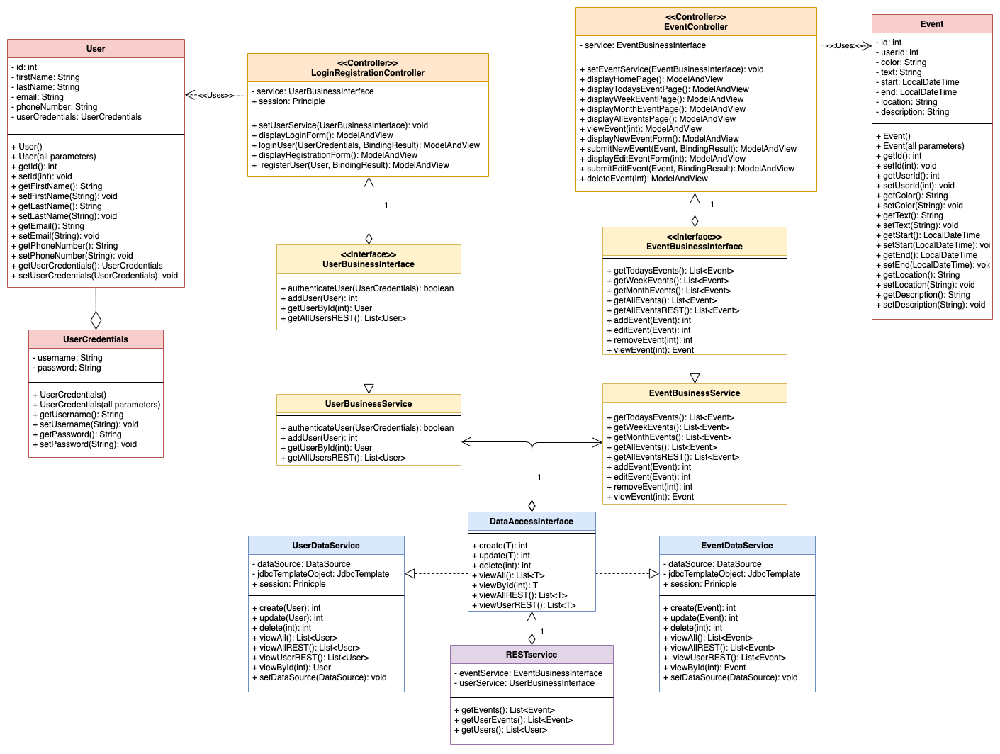
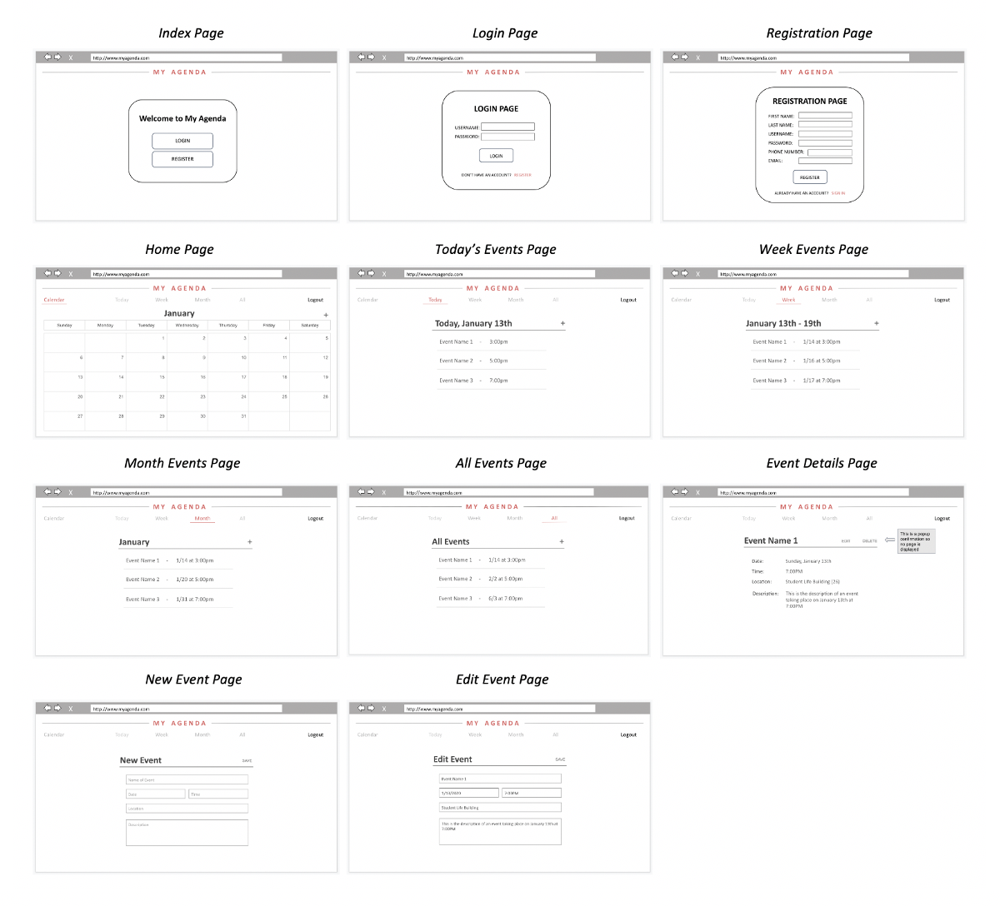
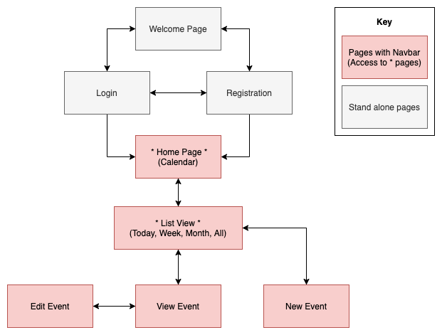
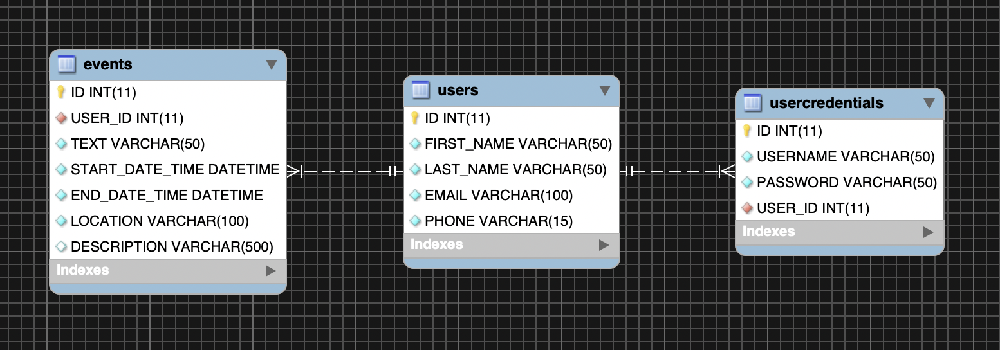
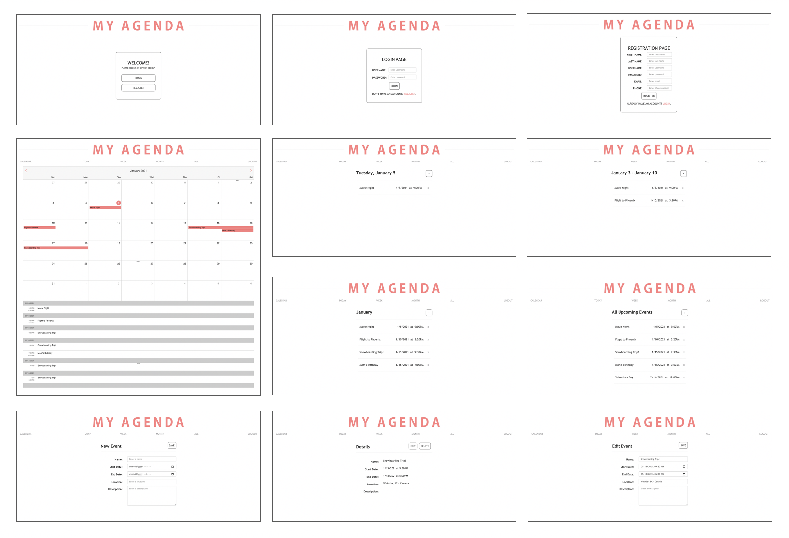

# Agenda Application - Fall 2020

Using Eclipse, I created a Java Spring application that allows a user to create a personal account to manage their own calendar of events. After registering a new account or logging in to one previously created, users can create and remove their own event(s) using add and delete functions, as well as the ability to edit event names, dates, times, locations, and descriptions. These events can be displayed as a list for the current day, week, month, or all events, as well as in a calendar view using a jQuery plugin called mobiscroll. The events were imported into the plugin using a REST service that produces the current user's events as JSON. A user can also press on an individual event to see the details. All necessary data for users and their event information is stored in a MySQL database, and used the Apache Tomcat server to make the application accessible on the localhost web.

The objective of this project was to build a complete enterprise class N-Layer application that met the following requirements:

	1. User Login and Registration
	2. Separation of presentation, business, and data layers
	3. Adhere to industry best practices such as exception handling
	4. Utilize the MVC design pattern
	5. Written using Spring MVC compliant pages
	6. Include at least one jQuery and Bootstrap component
	7. Perform CRUD operations on a product
	8. Execute data validation on all entry fields
	9. Connect to a relational database

<h2>Design</h2>

There were key design decisions that were implemented to make the web application more user friendly. Each user is only able to see their own agenda, can’t have more than one calendar, and their events are shown in various lists as well as a calendar view. The calendar view shows the current month and is tabular to see future months, while the list views are showing the current day, week, month, and all events. To limit the number of unnecessary pages, JavaScript popup windows were used for functions such as delete to avoid an extra page for a delete confirmation.

The planning for this project included using tools such as UML diagrams to determine class relationships, wireframes to outline each layout, as well as sitemap for page navigation within the website. Below is the UML diagram and the sitemap used.

<h3>UML Diagram</h3>

	

<h3>Digital Wireframes<h3>

	

	
<h3>Sitemap<h3>

	

<h2>Database</h2>

In order for this application to function properly, the use of a database was required. Within the database were tables for user's information, user's login credentials, and event information. Below is an ER diagram that shows those connections.

<h3>ER Diagram<h3>

	

<h2>Final Product</h2>

The final product for this project was a fully functioning agenda application. Below are some of the completed pages.

<h3>Web Pages<h3>

	

